# Aplicativo Consumer Fatec Eats

### Sobre
Aplicativo de pedidos.

### Tecnologia
Projeto Android desenvolvido com a linguagem java utilizando persistência de dados o Firebase com firestore através de coleções e documentos, para autenticação foi utilizado o método de email/senha (Authentication) do firebase.
 
 ### Recursos extras
 - Adicionado biblioteca Firebase-Auth para realizar autenticação e registros dos usuários
 - Adicionado biblioteca Glide para exibir imagens externas

### Funcionalidades 
 - Criar conta usuário consumidor;
 - Efetuar login;
 - Editar dados do usuário;
 - Adicionar tipo de pagamento;
 - Listagem tipo de pagamentos;
 - Adicionar plano de assinatura;
 - Listagem de assinaturas;
 - Adicionar comentários a produtos;
 - Listagem de comentários;
 - Apresentação de Banners;
 - Listagem de restaurantes;
 - Listagem de categorias;
 - Listagem de produtos;
 - Efetuar pedidos

 

### Telas do App

    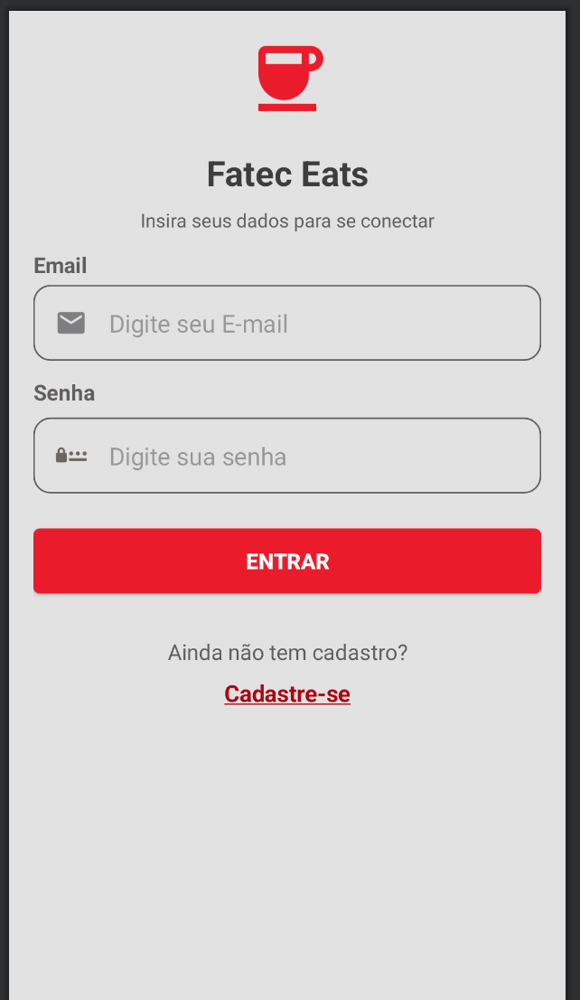
    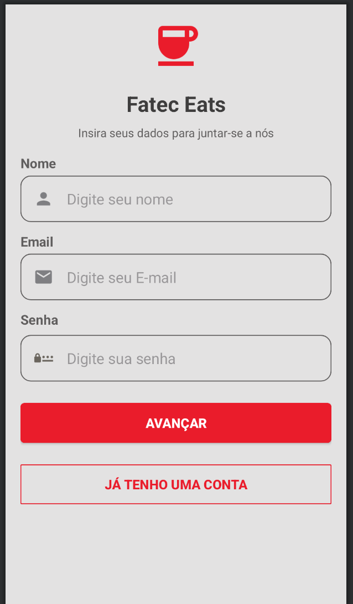
    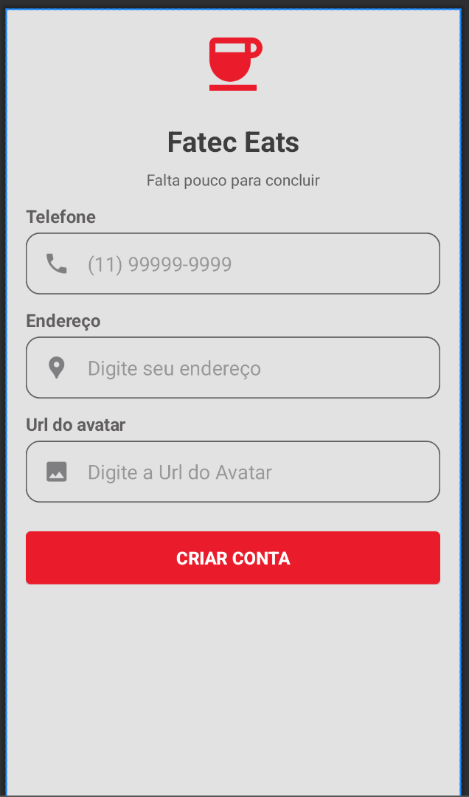
    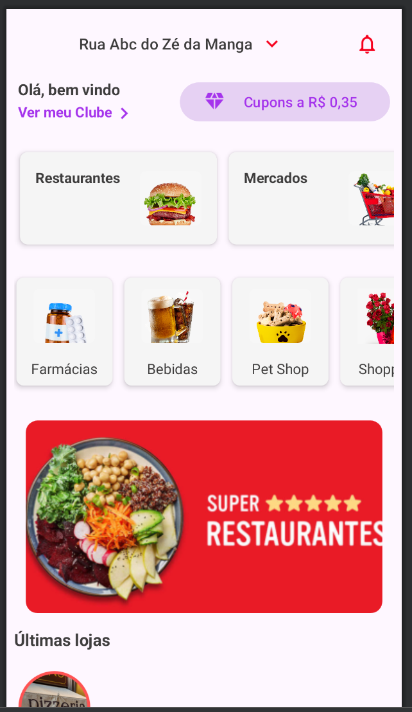
    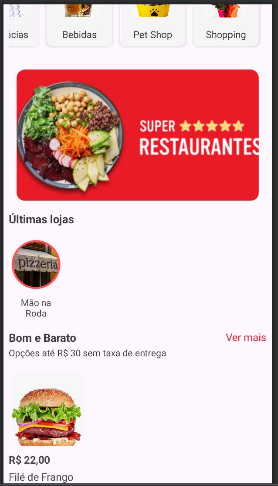
    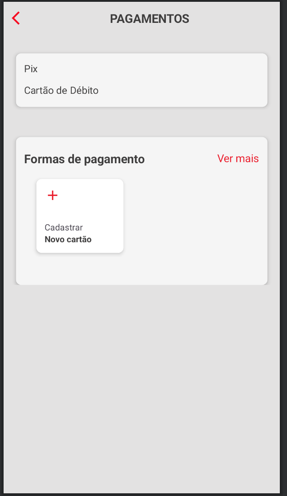
    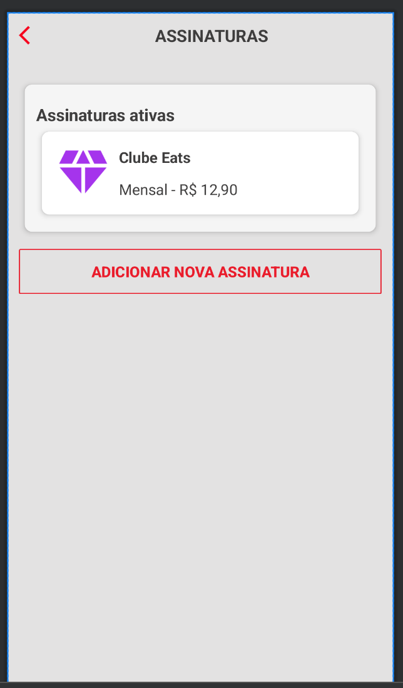   
    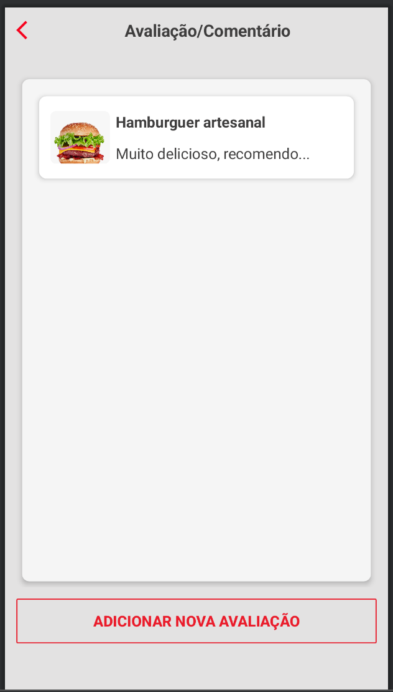

### Telas das Collections

    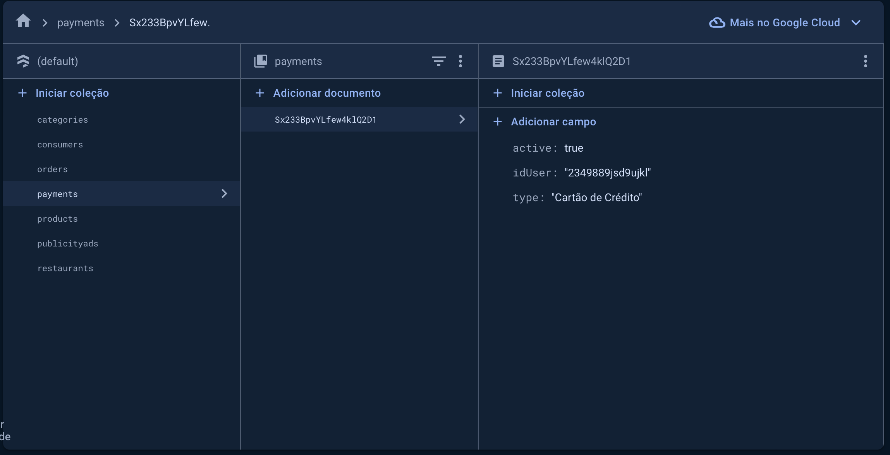
    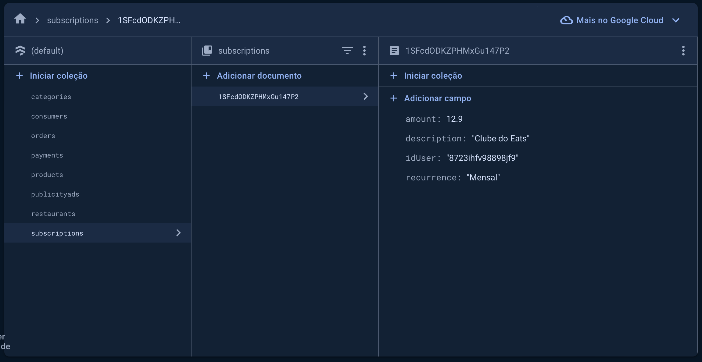
    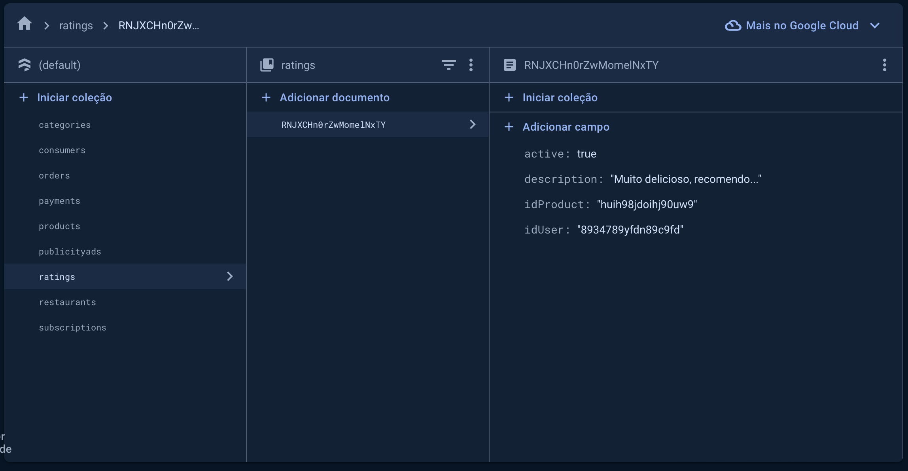
    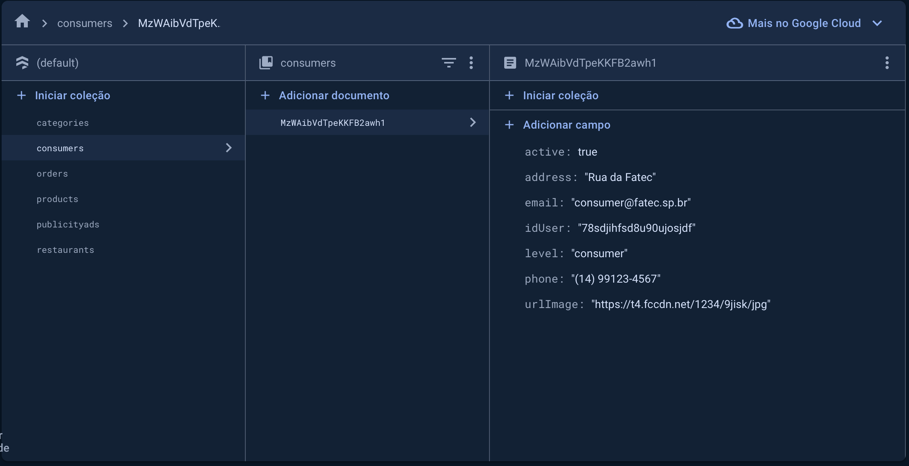    

